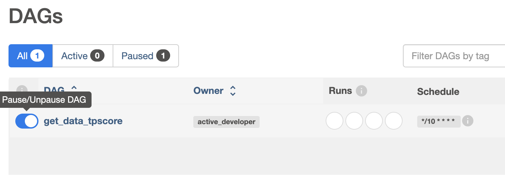

# TPScore

## Description
TPScore simplifies TPS Data Analysis for non-technical users in the Polkadot Ecosystem.

TPScore aims to provide non-technical users in the Polkadot ecosystem with an accessible and user-friendly platform for analyzing TPS (Transactions per Second) data. Our goal is to bridge the gap between technical intricacies and user-friendly visualization, empowering individuals to make informed decisions about blockchain adoption, investment, and development.

The project consists of two main parts:

1. ETL System
2. User Interface (UI) with Data Visualizations

This repository contains the ETL system, responsible for collecting blockchain data from Polkadot parachains, calculating the Transactions Per Second (TPS) for transactions of type Balance, and storing the processed data in a MySQL database. This repository is a part of Milestone 1 submission for the [Grants-Program](https://github.com/w3f/Grants-Program).

## Table of Contents

- [Installation](#installation)
- [Usage](#usage)
- [Testing Guide](#testing-guide)
- [Credits](#credits)
- [License](#license)

## Installation

Before running this project, make sure you have the following prerequisites installed:

1. [Docker](https://docs.docker.com/engine/install/)
2. [Python 3.9](https://www.python.org/downloads/release/python-3917/)

Follow these steps to set up and run the project:

**Clone the Project**

1. Clone this repository using `git clone` command.

**Create and Run MySQL Database Container**

2. Navigate to the 'db' directory from the project's root directory: `cd db`.
3. Build the Docker image using the Dockerfile: `docker build -t mysql_tpscore .`
4. Run a container with the MySQL database: `docker run --name db_mysql -d mysql_tpscore`

**Create and Run Airflow Container**

5. Navigate to the 'airflow' directory from the project's root directory: `cd airflow`.
6. Launch the airflow-init container: `docker compose up airflow-init`
7. Build an image using the Dockerfile and docker-compose files: `docker build .`
8. Start Airflow services: `docker compose up -d`

**Create a Network and Add Containers**

9. Create a Docker network: `docker network create net_tpscore`
10. Connect the 'db_mysql' container: `docker network connect net_tpscore db_mysql`
11. Connect the 'airflow_scheduler' container: `docker network connect net_tpscore airflow_scheduler`

## Usage

The application can be interacted with in two ways:

**Airflow GUI**

1. Access the Airflow GUI at http://localhost:8080/
2. Log in using the credentials (airflow, airflow)
   
3. Find the `get_data_tpscore` DAG and activate it by moving toggle to the right
   
4. Click on the DAG to verify successful execution (squares will be dark green, indicating error-free execution).
   

**MySQL Connection from Inside the Container**

1. Connect to the container: `docker exec -it db_mysql bash`
2. Log in to MySQL: `mysql -u user_tpscore -p`
3. Enter the password: `pass_tpscore`
4. Select the database: `USE tpscore_data;`
5. Run queries on the MySQL database, for example, select the top 3 TPS values: `SELECT * FROM tps ORDER BY tps DESC LIMIT 3;`
   

## Testing Guide

The core logic of the application is in [get_data_tpscore.py](https://github.com/BCS-Labs/tpscore-etl-system/blob/main/airflow/dags/get_data_tpscore.py). The script defines functions for database connection, fetching blockchain data, transformation, and data upload to the database. Tests for `get_data_tpscore.py` are in [test_get_data_tpscore.py](https://github.com/BCS-Labs/tpscore-etl-system/blob/main/airflow/dags/test_get_data_tpscore.py). Follow these steps to run the tests:

1. Create a virtual environment by running the command from the root project directory: `python -m venv venv_tpscore`
2. Activate the environment: `source venv_tpscore/bin/activate`
3. Install dependencies from `requirements.txt`: `pip install -r requirements.txt`
4. Run tests: `pytest`
   

## Credits

This open-source project was developed for the Polkadot community and relies on various open-source components and Python libraries:

- [Airflow](https://airflow.apache.org/)
- [Docker](https://www.docker.com/)
- [MySQL](https://www.mysql.com/)
- [pymysql](https://pypi.org/project/pymysql/)
- [pytest](https://docs.pytest.org/en/7.4.x/)
- [python-dotenv](https://pypi.org/project/python-dotenv/)
- [substrate-interface](https://polkascan.github.io/py-substrate-interface/)

## License

This project is licensed under GPLv3. For more details, refer to the [license document](https://github.com/BCS-Labs/tpscore-etl-system/blob/main/LICENSE).